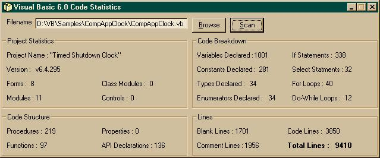



## Code Statistics v3\.0

### Description

This will get the statistics of your code, from how many forms/modules you have to the amount of If statements in your program. It's handy for getting a breakdown on the complexity of your code (and for showing off about how big your program is :) Let me know if you have any ideas for improvements, and as always, votes are definatly appreciated ;)
 
### More Info
 

             |
---                |---
**Submitted On**   |2002-01-27 14:55:06
**By**             |[Eric O'Sullivan](https://github.com/Planet-Source-Code/PSCIndex/blob/master/ByAuthor/eric-o-sullivan.md)
**Level**          |Intermediate
**User Rating**    |5.0 (20 globes from 4 users)
**Compatibility**  |VB 5\.0, VB 6\.0
**Category**       |[Coding Standards](https://github.com/Planet-Source-Code/PSCIndex/blob/master/ByCategory/coding-standards__1-43.md)
**World**          |[Visual Basic](https://github.com/Planet-Source-Code/PSCIndex/blob/master/ByWorld/visual-basic.md)
**Archive File**   |[Code\_Stati514041272002\.zip](https://github.com/Planet-Source-Code/eric-o-sullivan-code-statistics-v3-0__1-31221/archive/master.zip)

